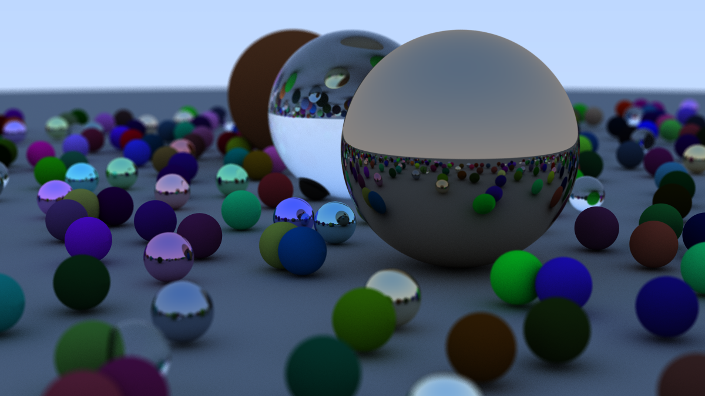

# Term Project, Rust Programming Language, 25 spring

This is my term project for the Rust Programming Language course in Spring 2025. This repo contains an implementation of [Ray Tracing in One Weekend](https://raytracing.github.io/books/RayTracingInOneWeekend.html) in Rust.

## Demo



## Usage

Simply run the following command to generate the image:
```bash
cargo run --release
# Or with link-time optimization
cargo run --profile release-lto
```
Note that the `--release` flag is necessary for performance reasons, since the code under debug mode is unbearably slow.

Moreover, the settings of the camera can be adjusted in `src/main.rs`. The default settings are suitable for a quick preview, but you may want to change them for a better quality image. I used `image_width=1200` and `sampling=500` to get a high-quality result, which may require a lot of time to render.
